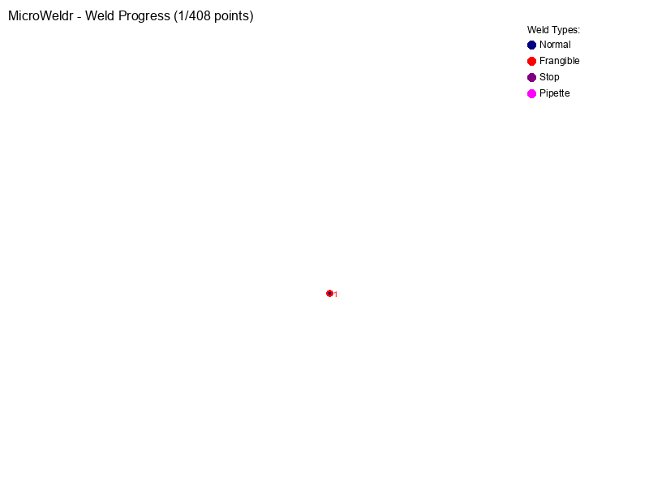

# MicroWeldr

[](https://badge.fury.io/py/microweldr)
[](https://github.com/retospect/microweldr/actions/workflows/test.yml)
[](https://github.com/retospect/microweldr/actions/workflows/codeql.yml)

A Python package that converts **SVG and DXF files** to Prusa Core One G-code for **continuous plastic line welding**. The package processes vector graphics and generates G-code that creates **waterproof welded lines** by placing many precise weld "dots" in sequence along the paths, without extruding any plastic material.

**Multi-Format Support** - Processes both SVG and DXF files with automatic weld type detection based on colors, layers, or filenames.

**Optimized for Prusa Core One**: Includes chamber temperature control (M141/M191), proper bed dimensions (250×220×270mm), and CoreXY-specific settings for reliable plastic welding operations.

This enables rapid **microfluidics prototyping** with a 3D printer by creating **sealed, waterproof channels and barriers**. Each vector path becomes a continuous welded line through precisely controlled sequential dot placement.



*Complete welding process showing both normal welds (blue) and frangible welds (red) with 1mm spacing and 2mm diameter dots representing actual welding spots*

## 🆕 Version 6.1.4

- **Unified Configuration**: Consistent 1mm dot spacing across SVG and DXF formats
- **Professional Examples**: Complete example collection with combined weld types
- **Improved Animations**: Uniform timing with 3-second pause for final result viewing
- **Proper Weld Heights**: 0.1mm normal welds, 0.6mm frangible welds for breakaway functionality
- **Comprehensive Testing**: Full test coverage including weld height validation
- **Modern Dependencies**: Updated to pytest 9.0.1, pre-commit 4.4.0, optimized package set
- **CI/CD Ready**: Complete GitHub Actions workflows with multi-platform testing

## Project Structure

```
microweldr/
├── microweldr/           # Main package
│   ├── core/            # Core functionality & configuration
│   │   ├── config.py          # Configuration management
│   │   ├── unified_config.py  # Unified configuration system
│   │   ├── data_models.py     # Structured data models
│   │   ├── events.py          # Event system for processing
│   │   └── constants.py       # Application constants
│   ├── parsers/         # File format parsers
│   │   ├── dxf_reader.py      # DXF file processing
│   │   ├── svg_parser.py      # SVG file processing
│   │   └── enhanced_svg_parser.py # Advanced SVG features
│   ├── generators/      # Point and G-code generation
│   │   ├── point_iterator_factory.py # Factory pattern for iterators
│   │   ├── svg_point_iterator.py     # SVG point generation
│   │   └── dxf_point_iterator.py     # DXF point generation
│   ├── outputs/         # Output generation
│   │   ├── streaming_gcode_subscriber.py # G-code generation
│   │   └── gif_animation_subscriber.py   # Animation generation
│   ├── cli/             # Command line interface
│   │   ├── simple_main.py     # Main CLI entry point
│   │   └── enhanced_main.py   # Advanced CLI features
│   └── prusalink/       # Printer integration
├── tests/               # Comprehensive test suite
│   ├── unit/           # Unit tests (121 tests)
│   ├── parsing/        # Parser tests
│   ├── outputs/        # Output generation tests
│   └── test_linting.py # Code quality tests
├── examples/           # Professional example collection
│   ├── flask_simple.svg        # SVG example (628 points)
│   ├── flask.dxf              # DXF example (467 points)
│   ├── combined_normal.dxf     # Combined example (801 points)
│   ├── combined_frangible.dxf  # Frangible welds (5 points)
│   └── *.gif                  # Generated animations
└── pyproject.toml     # Modern Poetry configuration (PEP 621)
```

## Features

### File Format Support
- **SVG Files**: Paths, lines, circles, rectangles, groups, and use elements
- **DXF Files**: Lines, arcs, circles, polylines, and LWPOLYLINES
- **Multi-File Processing**: Mix SVG and DXF files in single command
- **Unit Validation**: DXF files must use millimeters (throws exception otherwise)
- **Construction Filtering**: Automatically ignores construction layers in DXF

### Weld Type Detection
Multiple methods for determining weld types:

#### 1. Color-Based (SVG)
- **Black elements** → Normal welds
- **Blue elements** → Frangible welds (breakaway seals)
- **Red elements** → Stop points (pause for user intervention)
- **Magenta elements** → Pipette points (filling operations)

#### 2. Layer-Based (DXF)
- **Normal layers**: Any layer name
- **Frangible layers**: Containing `frangible`, `light`, `break`, `seal`, `weak`
- **Construction layers**: Containing `construction`, `const`, `guide`, `reference`, `ref` (ignored)

#### 3. Filename-Based (Fallback)
When colors/layers don't specify weld type, filenames are checked:
- **Normal welds**: `main_welds.dxf`, `structure.svg`
- **Frangible welds**: `frangible_seals.dxf`, `light_welds.svg`, `break_points.dxf`

### Advanced Features
- **Configurable Parameters**: TOML-based configuration for temperatures, heights, and timing
- **Multi-Pass Welding**: Configurable initial and final dot spacing
- **Optimized Z Movement**: Separate weld move height for faster intra-path welding
- **Chamber Temperature Control**: Prusa Core One chamber heating
- **Animation Output**: Generates animated SVG showing the welding sequence
- **Proper G-code Structure**: Includes heating, cooling, and safety procedures
- **Error Handling**: Comprehensive error reporting and recovery
- **Statistics Collection**: Processing metrics and validation results

## Installation

### From PyPI
```bash
pip install microweldr
```

### With DXF Support
```bash
pip install microweldr[dxf]  # Includes ezdxf for DXF processing
```

### From Source
```bash
git clone https://github.com/retospect/microweldr.git
cd microweldr
poetry install --with dev
```

## Quick Start

### Basic Usage
```bash
# Convert single SVG file
microweldr -weld design.svg -g_out output.gcode

# Convert DXF file with unit validation
microweldr -weld drawing.dxf -g_out output.gcode

# Process combined normal and frangible welds
microweldr -weld main_welds.dxf -frange frangible_seals.dxf -g_out combined.gcode

# Generate animation along with G-code
microweldr -weld design.svg -g_out output.gcode -animation output_animation.gif
```

### Fusion 360 Workflow
Perfect for CAD-based microfluidics design:

1. **Design in Fusion 360**: Create your microfluidic channels and seals
2. **Export two DXF files**:
   - `main_welds.dxf` - Primary structural welds
   - `frangible_seals.dxf` - Breakaway seals for filling ports
3. **Process both files**: `microweldr -weld main_welds.dxf -frange frangible_seals.dxf -g_out device.gcode`
4. **Print**: Load G-code on Prusa Core One

### Configuration

Create `microweldr_config.toml` for custom settings:

```toml
[printer]
bed_x = 250
bed_y = 220
bed_z = 270
chamber_temperature = 45

[movement]
move_height = 5.0  # mm - height for safe movement between paths
weld_height = 0.02  # mm - height for actual welding (touching plastic)
weld_move_height = 2.0  # mm - height for moving between weld points (faster than safe height)
frame_height = 10.0  # mm - height for frame drawing (clearance check)
travel_speed = 3000  # mm/min - travel speed for movements
z_speed = 600  # mm/min - optimized Z speed (near maximum safe limit for Core One)

[normal_welds]
weld_height = 0.1           # mm - structural weld depth
weld_temperature = 160      # °C - nozzle temperature
weld_time = 0.1            # seconds - dwell time
dot_spacing = 0.5          # mm - unified spacing

[frangible_welds]
weld_height = 0.6          # mm - deeper for breakaway functionality
weld_temperature = 160     # °C - same temperature
weld_time = 0.3           # seconds - longer for controlled weakness
dot_spacing = 0.5         # mm - unified spacing

[output]
gcode_extension = ".gcode"
animation_extension = "_animation.svg"
```

## Command Reference

### Main Command
```bash
microweldr [OPTIONS]

Options:
  -weld PATH           Normal weld file (SVG or DXF)
  -frange PATH         Frangible weld file (SVG or DXF)
  -g_out PATH          Output G-code file
  -animation PATH      Output animation GIF file
  -quiet              Suppress verbose output
  --help              Show help message
```

### Examples
```bash
# Single file processing
microweldr -weld design.svg -g_out output.gcode

# Combined weld types
microweldr -weld structural.dxf -frange seals.dxf -g_out device.gcode

# With animation
microweldr -weld design.svg -animation preview.gif -g_out output.gcode
```

## File Format Details

### SVG Support
- **Elements**: `<path>`, `<line>`, `<circle>`, `<rect>`, `<g>`, `<use>`
- **Attributes**: `stroke`, `class`, `id` for weld type detection
- **Namespaces**: Handles standard SVG namespaces
- **Definitions**: Processes `<defs>` and referenced elements

### DXF Support
- **Entities**: LINE, ARC, CIRCLE, POLYLINE, LWPOLYLINE
- **Units**: Must be millimeters (validated automatically)
- **Layers**: Used for weld type and construction detection
- **Coordinate System**: Preserves original coordinates

### Weld Type Examples

#### Filename-Based Detection
```bash
# These filenames automatically detect frangible welds:
microweldr convert frangible_seals.dxf      # → Frangible
microweldr convert light_connections.svg    # → Frangible
microweldr convert break_points.dxf         # → Frangible
microweldr convert seal_layer.svg           # → Frangible

# These default to normal welds:
microweldr convert main_structure.dxf       # → Normal
microweldr convert primary_welds.svg        # → Normal
```

#### Layer-Based Detection (DXF)
```
Layer "main_welds"        → Normal welds
Layer "frangible_seals"   → Frangible welds
Layer "construction"      → Ignored
Layer "break_points"      → Frangible welds
```

## Development

### Running Tests
```bash
poetry run pytest                    # All tests
poetry run pytest tests/unit/       # Unit tests only
poetry run pytest -v               # Verbose output
```

### Code Quality
```bash
poetry run black .                  # Format code
poetry run bandit -r microweldr/   # Security check
poetry run pre-commit run --all-files  # All checks
```

### Building
```bash
poetry build                        # Build wheel and source
poetry install dist/*.whl          # Install local build
```

## Examples

### Professional Examples
```bash
# See examples/ directory for complete example collection:
# - flask_simple.svg (628 points, Bézier curves)
# - flask.dxf (467 points, line interpolation)
# - combined_normal.dxf + combined_frangible.dxf (806 total points)

# Process the combined example
microweldr -weld examples/combined_normal.dxf \
           -frange examples/combined_frangible.dxf \
           -g_out examples/combined_animation.gif \
           -animation examples/combined_animation.gif
```

### Production Workflow
```bash
# 1. Design in CAD software (Fusion 360, etc.)
# 2. Export separate files for different weld types
# 3. Process with MicroWeldr
microweldr -weld structural_welds.dxf -frange breakaway_seals.dxf -g_out device.gcode

# 4. Load G-code on Prusa Core One and print
```

## Troubleshooting

### DXF Issues
- **Unit Error**: Ensure DXF uses millimeters in drawing units
- **No Entities**: Check that layers contain supported entities (lines, arcs, circles)
- **Construction Layers**: Rename layers to avoid construction keywords

### SVG Issues
- **No Paths**: Ensure elements have `stroke` attribute (not just `fill`)
- **Complex Paths**: Curves are approximated with line segments
- **Nested Groups**: Deep nesting may affect processing

### Weld Type Detection
- **Wrong Type**: Check filename, layer names, or SVG colors
- **All Normal**: Add frangible keywords to filenames or layers
- **All Frangible**: Remove frangible keywords from filenames

## Contributing

1. Fork the repository
2. Create a feature branch: `git checkout -b feature-name`
3. Make changes with tests: `poetry run pytest`
4. Format code: `poetry run black .`
5. Submit pull request

## License

MIT License - see LICENSE file for details.

## Changelog

### Version 5.3.0 (Latest)
- **NEW**: Full DXF file support with ezdxf integration
- **NEW**: Multi-file processing (mix SVG and DXF)
- **NEW**: Filename-based weld type detection as fallback
- **BREAKING**: Renamed "light_welds" to "frangible_welds" in all configs
- **IMPROVED**: Modular CLI architecture with better error handling
- **IMPROVED**: Publisher-subscriber file processing framework
- **IMPROVED**: Comprehensive test coverage (33 tests)
- **IMPROVED**: Structured data models with validation

### Version 5.2.x
- Enhanced SVG processing
- Animation improvements
- Configuration validation

### Version 5.1.x
- Initial public release
- Basic SVG to G-code conversion
- Prusa Core One optimization
